# AIndustriosa-Branding
Panel de logos de patrocinadores e colaboradores interactivo, construidos mediante ferramentas de fabricación dixital (Impresión 3D, corte laser, CNC…)

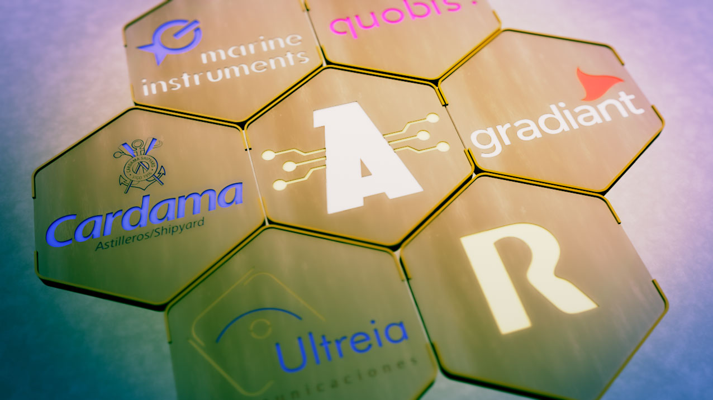

Durante este ano un dos proxectos propostos foi a elaboración dun novo panel de patrocinadores, intentando empregar todos os medios disponibles na Industriosa.

A idea era facer un panel interactivo de logos que se poidese integrar co Home Assistant do local, e usalo tamben de sinalítica.

A parte electrónica usamos tiras de led RGB de 5V coa idea que mediante sinxelas circuitos con un microcontrolador controlar cada panel.

Para empezar o deseño da base foi elaborada con InkScape.

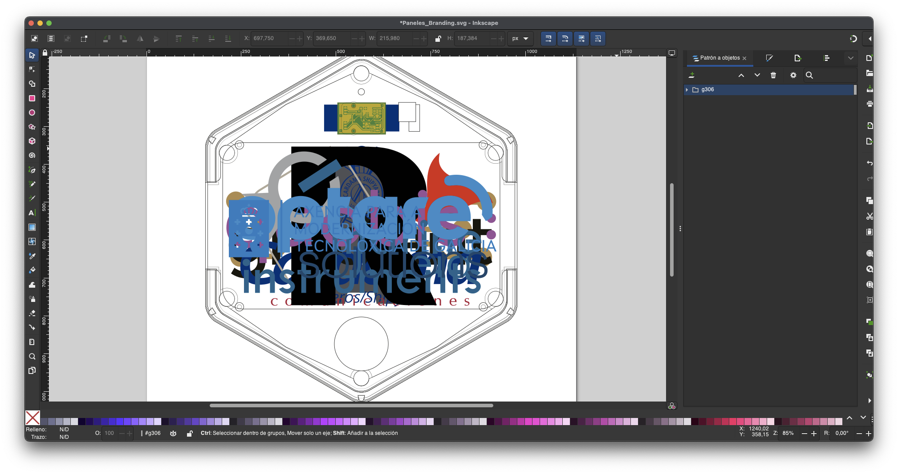

Partindo los vectores modelamos nun programa de 3d mediante ferramentas de extrusión e operacións boleanas as bases e soportes los leds.

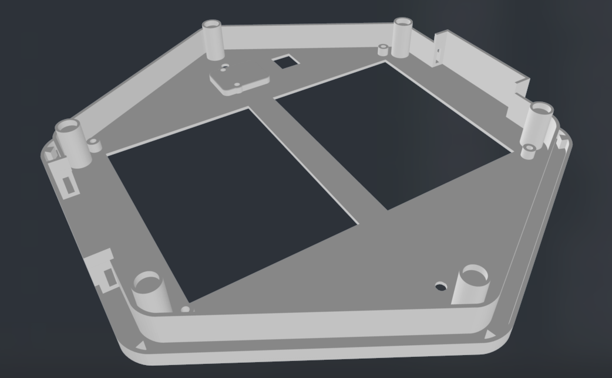

Con mesmo SVG sacamos os soportes dos leds de cada logo, deixando unha marxe para colocar as luces.

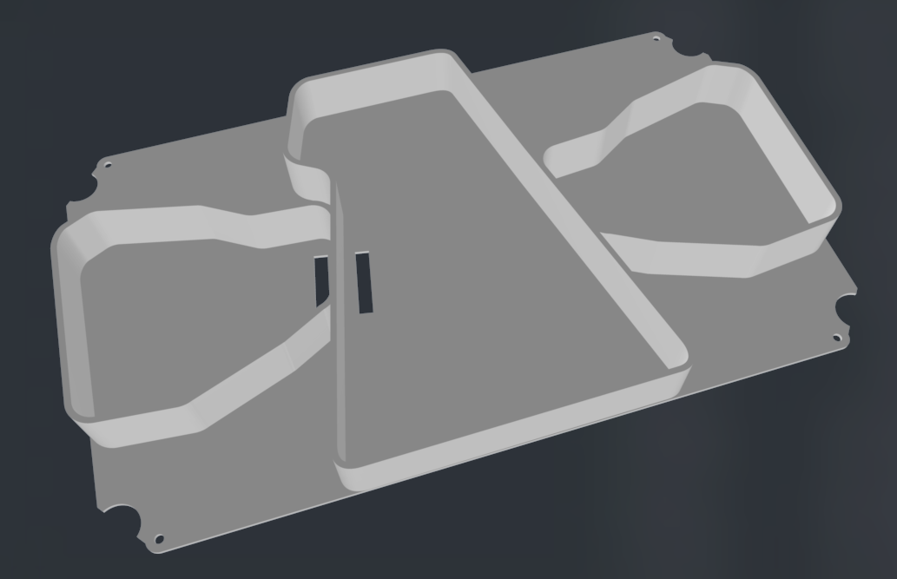

A maioria dos elementos foron impresos en 3d, dende as bases con PLA negro e as partes translucidas en PLA blanco con apenas 2 capas de recheo.

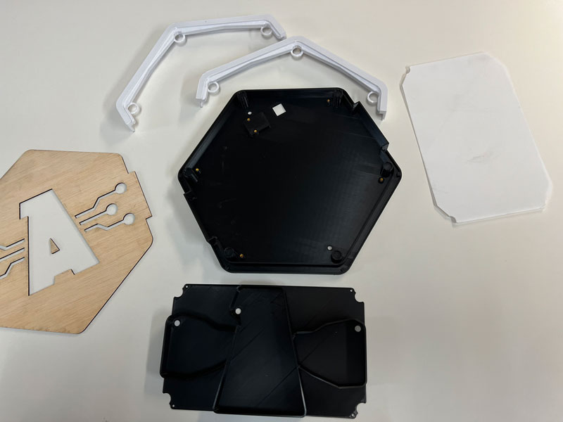

Para o deseño das pcbs, usamos o kicad, facendo unha sinxela placa cun Atiny412, dos saidas para duas tiras leds, toma de corrente e I2C, así como pin para programalos por UPDI

# Lista de materiais BOM

- Placas de Circuito de PCB **FR1** [Amazon](https://www.amazon.es/dp/B087M1GDCP?psc=1&smid=A839N7HCQOMKL&ref_=chk_typ_imgToDp)
- Fresa 0.4 End Mill -> 1/32 -> 0,4 MM -> TRACES [Aliexpress](https://es.aliexpress.com/item/32914096470.html?spm=a2g0o.order_list.0.0.19bb194dGODsyC&gatewayAdapt=glo2esp)
- Fresa 0.8 End Mill -> 1/64 -> 0,8 MM -> CUT [Aliexpress](https://es.aliexpress.com/item/32914096470.html?spm=a2g0o.order_list.0.0.19bb194dGODsyC&gatewayAdapt=glo2esp)

| Compoñente | Unidades | Código | Tenda | Footprint |
| ----- | ---- | ---- | ---- | ---- |
| ATtiny412 | 1 | ATTINY412-SSF-ND | [Digikey](https://www.digikey.es/en/products/detail/microchip-technology/ATTINY412-SSF/9947539) | SOIC-8_3.9x4.9mm_P1.27mm |
| Cap 10 uF | 1 | GRT31CC8YA106ME01L | [Digikey](https://www.digikey.es/en/products/detail/murata-electronics/GRT31CC8YA106ME01L/5416847) | C_1206 |
| Res 0 Ohms | 1 | RC1206FR-070RL | [Digikey](https://www.digikey.com/en/products/detail/yageo/RC1206FR-070RL/5698945) | R_1206 |
| Res 499 Ohms | 1 | RC1206FR-07499RL | [Digikey](https://www.digikey.es/en/products/detail/yageo/RC1206FR-07499RL/728944) | R_1206 |
| LED RED | 1 | 1516-1076-1-ND  | [Digikey](https://www.digikey.es/es/products/detail/qt-brightek-qtb/QBLP615-R/4814674) | LED_1206 |
| Connector 1x03_P2.54mm_Horizontal | 3 | S1143E-36-ND  | [Digikey](https://www.digikey.es/es/products/detail/sullins-connector-solutions/GBC36SGSN-M89/862355) | PinHeader_1x03_P2.54mm_Horizontal_SMD |

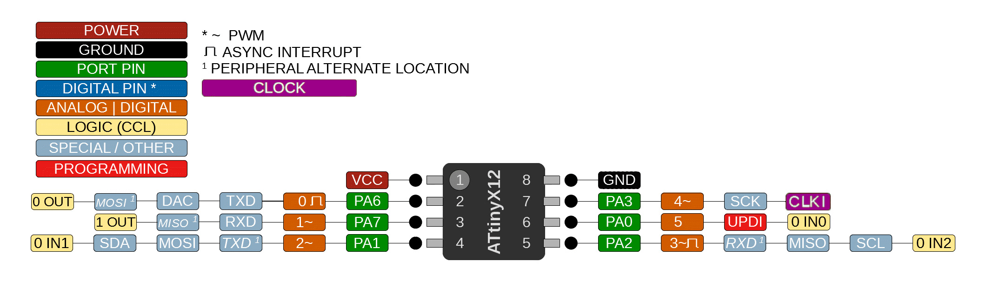

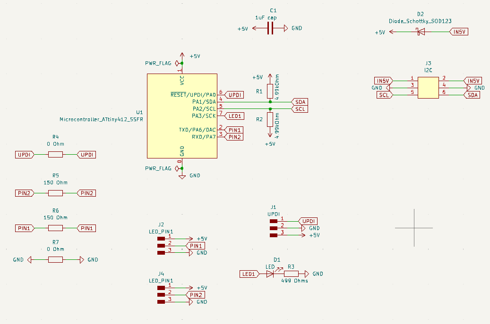

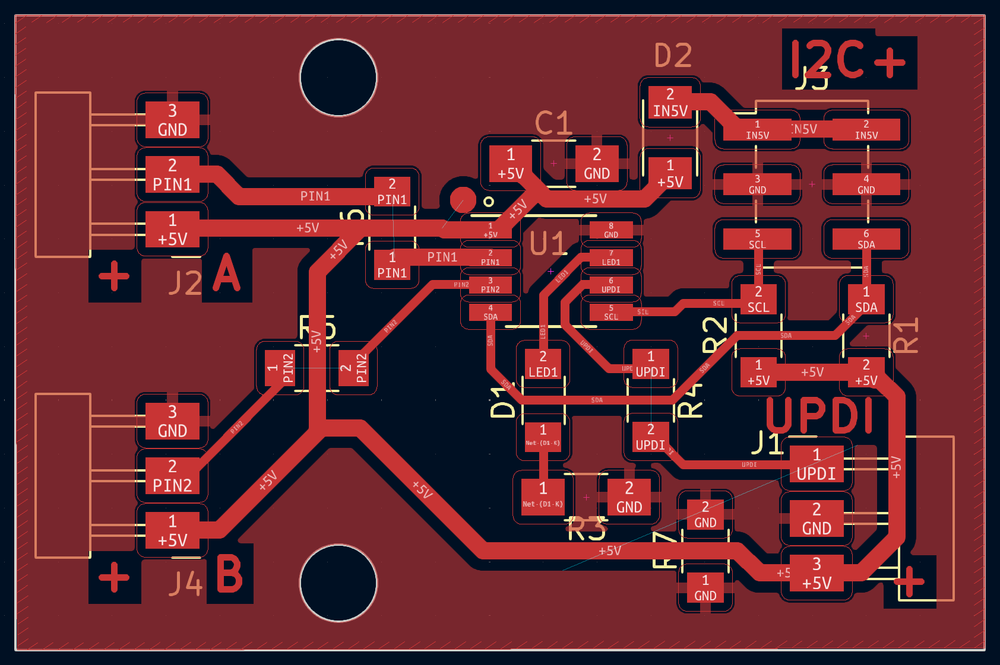

Unha vez tiñamos o deseño da PCB exportamos a SVG a capa frontal e a capa de corte, para mediante GIMP xerar os png para facer of gcode con <a href="https://modsproject.org" target="_blank">ModsProject</a>.

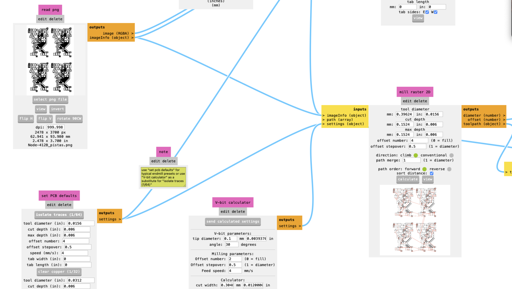

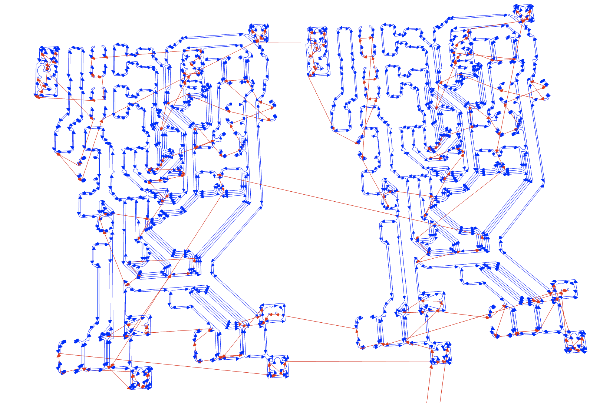

Unha vez xerados os gcode, nunha CNC 3018 da asociación, usando o <a href="https://winder.github.io/ugs_website/" target="_blank">UGS</a> fabricamos as placas.

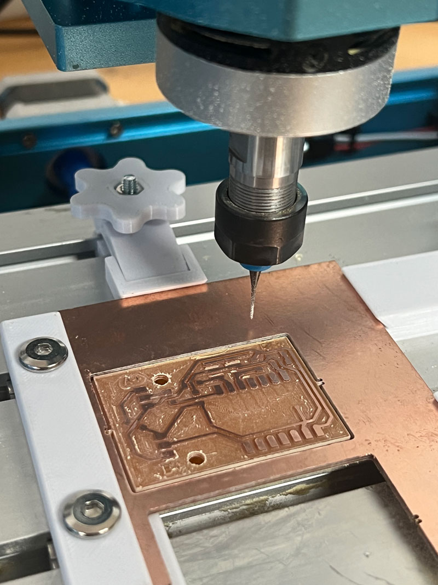

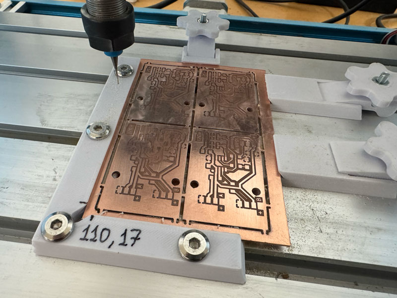

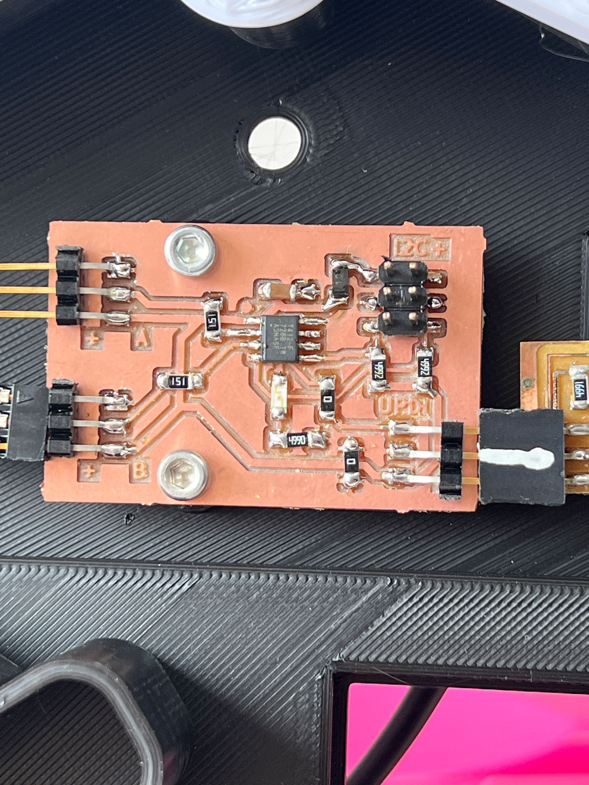

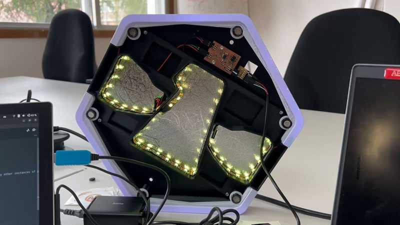

Unha vez fabricado o primeiro prototipo, mediante Arduino IDE empezamos a programar o funcionamento los LEDs. Debido o limite de memoria para usar más de 50 led, fixemos no código duas funcións onde despois de encender unha tira dun pin, liberamos a memoria, para encender os outros leds.

Con corte laser cortamos o panel en chopo de 3mm.

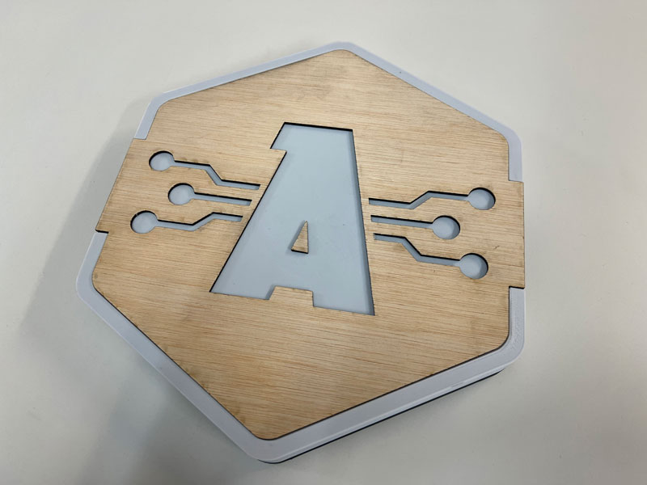

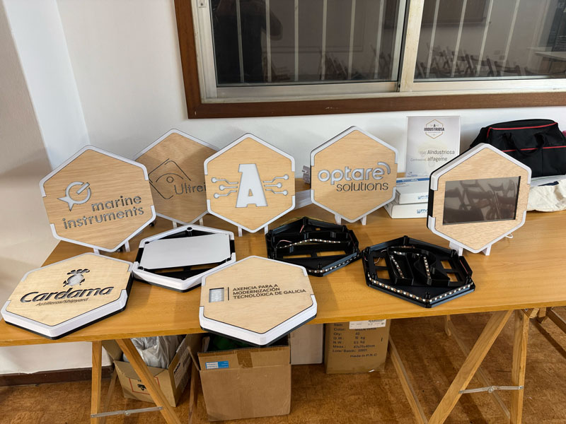

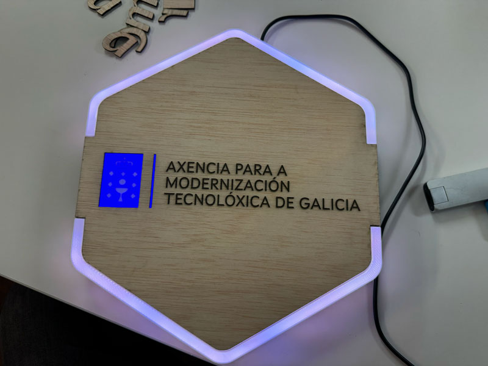

<b>Proxecto patrocinado por Xunta de Galicia e Amtega Axencia para a Modernización Tecnolóxica</b>